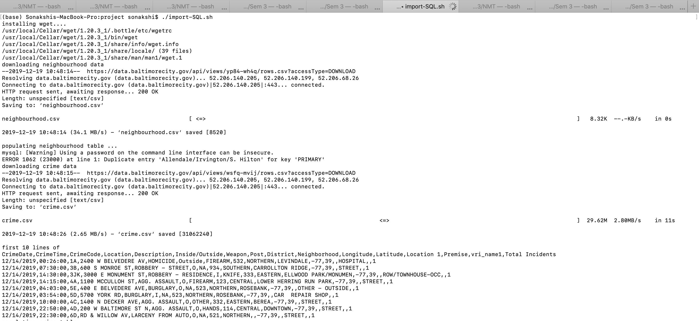

# EN.601.615_DatabasesCourseProject

This project focuses on the analysis of crime in Baltimore City. We propose to analyze different kinds of databases such as crime records, census demographics, education, religious buildings, libraries, police stations, homeless shelters in the city and gain insights from them. 

## Getting Started

Please follow these instructions to get the project running on your local machine. 

### Prerequisites

You need to install python and mysql server. Install mysql workbench. Anaconda would be best to install python since we are using pandas and gmplot in our code base.  The bash script is also using wget package for downloading the data from the urls but our .sh script automatically installs it. 

### Steps: 

1. Run the createSchema.sql file - This is for setting up the schema for the project's database. We are using server name as 	"localhost", user name as " root", password as "yes" and database as "projectdb" in our code. Please change them 			accordingly. 

		On MySQL workbench -  open the file and run it.
		On terminal - $ mysql -u username password < "createSchema.sql"  

2. Run the import-SQL.sh - This is for populating the database. The import-SQL.sh file will take a few minutes (~30 min) to  	run since its downloading the .csv files from their urls on data.baltimorecity.gov/api/ and then is populating the entire 	 database. Some of the relations have more than a million rows, so it will take some time to run. You can save on time by 	 directly accessing the csv files in /Data folder in the project folder. That already has the csv files saved in it.

		chmod +x import-SQL.sh
		./import-SQL.sh

3. Run Queries.sql -  This is for running all the SQL queries

		On MySQL workbench -  open the file and run it.
		On terminal - $ mysql -u username password < "createSchema.sql"  

4. Run SpatialMap.py - This file takes in the input from the file heatmapData.csv (which has the output from query Q1 in 	   Queries.sql) and plots a heatmap. 

		python SpatialMap.py  
 
   The script produces a .html file in the project folder which can be viewed in any browser. Also, you'll have to replace the gmap API key in the script with your key. 
   
   
   Some screenshots for running of the above commands are - 
   
    
    
    
    
    
 
   
 Here is the heatmap we get for the crimecounts in Baltimore City - 

 
 

## Authors

Sonakshi Grover (sgrover3@jhu.edu)  
Sai Rajarishi Ulapu (sulapu1@jhu.edu)

## License

This project is licensed under the MIT License - see the [LICENSE.md](LICENSE.md) file for details

## Acknowledgments

We would like to thank Professor David Yarowsky for guiding us in this project.

